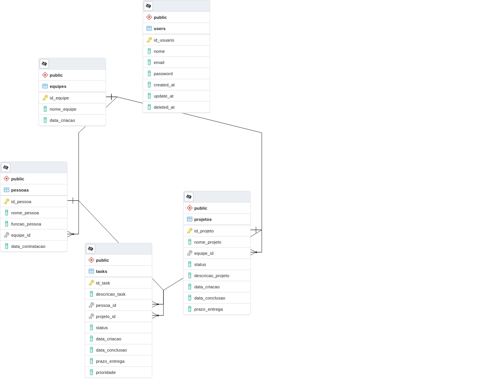

<div align="center" display="flex">
  
  
  <h1 align="center">API com Golang, Gin-Gonic e PostgreSQL</h1>
</div>


<p>Disponível para acesso em: https://golang-posgre-brisanet.herokuapp.com/</p>

# Desenvolvedor
<ul>
  <li><a href="https://github.com/caiosousaf">Caio Sousa</a></li>
</ul>

# Menu
* [Sobre o Sistema](#sobre-o-sistema)
* [Funcionalidades](#funcionalidades)
* [Projetos](#projetos)
    * [Exibir Todos os Projetos](#exibir-todos-os-projetos)
    * [Exibir Projeto Específico](#exibir-projeto-especifico)
    * [Exibir Tarefas de um Projeto](#exibir-tarefas-de-um-projeto)
    * [Exibir Projetos com um Status Específico](#exibir-projetos-com-um-status-especifico)
    * [Cadastrar Projeto](#cadastrar-projeto)
    * [Editar Projeto](#editar-projeto)
    * [Deletar Projeto](#deletar-projeto)
* [Equipes](#equipes)
    * [Exibir Todas as Equipes](#exibir-todas-as-equipes)
    * [Exibir Equipe Específica](#exibir-equipe-especifica)
    * [Exibir Pessoas de uma Equipe](#exibir-pessoas-de-uma-equipe)
    * [Cadastrar Equipe](#cadastrar-equipe)
    * [Editar Equipe](#editar-equipe)
    * [Deletar Equipe](#deletar-equipe)
* [Pessoas](#pessoas)
    * [Exibir Todas as Pessoas](#exibir-todas-as-pessoas)
    * [Exibir Pessoas Específica](#exibir-pessoa-especifica)
    * [Exibir Tarefa de uma Pessoa](#exibir-tarefa-de-uma-pessoa)
    * [Cadastrar Pessoa](#cadastrar-pessoa)
    * [Editar Pessoa](#editar-pessoa)
    * [Deletar Pessoa](#deletar-pessoa)
* [Tarefas](#tarefas)
    * [Exibir Todas as Tarefas](#exibir-todas-as-tarefas)
    * [Exibir Tarefa Específica](#exibir-tarefa-especifica)
    * [Exibir Status das Tarefas](#exibir-status-das-tarefas)
    * [Exibir Tarefas com um Status Específico](#exibir-tarefas-com-um-status-especifico)
    * [Cadastrar Tarefa](#cadastrar-tarefa)
    * [Editar Tarefa](#editar-tarefa)
    * [Deletar Tarefa](#deletar-tarefa)
* [Relacionamento dos Elementos](#relacionamento-dos-elementos)
* [Avisos](#avisos)

# Sobre o Sistema
- Um sistema para manter projetos e equipes. o sistema deve cadastrar projetos, equipes, tarefas e pessoas, um projeto possui uma equipe atribuida e deve ter tarefas dentro do projeto onde os membros da equipe podem se atribuir;

- Foi desenvolvido com [Golang](https://go.dev/), [Gin-Gonic](https://gin-gonic.com/) e [PostgreSQL](https://www.postgresql.org);
- A API e o Banco de dados estão estão sendo mantidos no [Heroku](https://www.heroku.com).


# Funcionalidades

| Funcionalidade         | Estado |
| ------------- |:-------------:|
| Manter equipe      | ✔️ |
| Manter projeto      | ✔️ |
| Associar equipe a projeto | ✔️ | 
| Criar tarefa no projeto | ✔️ | 
| Atribuir tarefa | ✔️ | 
| Utilizar algum SGBD (PostgreSQL/MySQL) | ✔️ |


#  Projetos
<p>- Cada Projeto possui um ID, um Nome e uma Equipe associada.<p>
<p>- Em um projeto, só podemos ter uma equipe trabalhando</p>

## Exibindo Todos os Projetos
<p>- Usando o método GET podemos acessar o seguinte endereço:</p>

```
https://golang-posgre-brisanet.herokuapp.com/projetos
```
<p>- Todos os Projetos serão retornados</p>

## Exibir Projeto Especifico
<p>- Para Buscar algum elemento individualmente, precisamos passar o ID como parametro.</p>
<p>- Usando o método GET podemos acessar o seguinte endereço:</p>

```
https://golang-posgre-brisanet.herokuapp.com/:id
```
<p>- Um projeto com o id em especifico será retornado se caso ele existir</p>

## Exibir Tarefas de um Projeto
<p>- Para Buscar as tarefas de um respectivo projeto, precisamos passar um ID como parametro.</p>
<p>- Usando o método GET podemos acessar o seguinte endereço:</p>

```
https://golang-posgre-brisanet.herokuapp.com/projetos/:id/tasks
```


## Exibir Projetos com um Status Especifico
<p>- Para Buscar projetos com um status especifico precisamos passar o status esperado como parametro.</p>
<p>- Usando o método GET podemos acessar o seguinte endereço:</p>

```
https://golang-posgre-brisanet.herokuapp.com/projetos/status/:status
```

## Cadastrar Projeto
<p>Um projeto tem os seguintes campos:
<ul>
  <li>Nome_Projeto</li>
  <li>Equipe_ID</li>
  <li>Descricao_Projeto</li>
</ul>
<p>Todos os projetos na hora da criação recebem a data de criação e o status: "Em Andamento"</p>
<p>- Usando o método POST podemos acessar o seguinte endereço e cadastrar um elemento:</p>

```
https://golang-posgre-brisanet.herokuapp.com/projetos
```

## Editar Projeto
<p>- Para editar um projeto, precisamos passar o ID do respectivo projeto como parametro</p>
<p>- Usando o método PUT podemos acessar o seguinte endereço:</p>
<p>Para que o Projeto seja editado com sucesso, devemos ter os seguintes campos no body:</p>
<ul>
  <li>Nome_Projeto</li>
  <li>Equipe_ID</li>
  <li>Descricao_Projeto</li>
</ul>
```
https://golang-posgre-brisanet.herokuapp.com/projetos/:id
```

## Deletar Projeto
<p>- Para deletar um projeto, precisamos passar o ID do respectivo projeto como parametro</p>
<p>- Usando o método DELETE podemos acessar o seguinte endereço:</p>

```
https://golang-posgre-brisanet.herokuapp.com/projetos/:id
```


# Equipes
## Exibir todas as Equipes
<p>- Usando o método GET podemos acessar o seguinte endereço:</p>

```
https://golang-posgre-brisanet.herokuapp.com/equipes
```
<p>O retorno esperado é a listagem de todas as equipes cadastradas com os membros de cada equipe em um objeto para cada equipe</p>

## Exibir Equipe Especifica
<p>- Para Buscar alguma equipe em especifica, devemos utilizar o ID da respectiva equipe.</p>
<p>- Usando o método GET podemos acessar o seguinte endereço:</p>

```
https://golang-posgre-brisanet.herokuapp.com/equipes/:id
```

## Exibir Pessoas de uma Equipe
<p>- Para buscar os membros de uma equipe especifica, devemos passar o id da equipe como parametro</p>
<p>- Usando o método GET podemos acessar o seguinte endereço:</p>

```
https://golang-posgre-brisanet.herokuapp.com/equipes/:id/pessoas
```
<p>Exibe os membros de uma equipe especifica</p>


## Cadastrar Equipe
<p>Uma equipe tem o seguinte campo:</p>
<ul>
  <li>Nome_Equipe</li>
</ul>
<p>- Usando o método POST podemos acessar o seguinte endereço e cadastrar uma nova equipe:</p>

```
https://golang-posgre-brisanet.herokuapp.com/equipes
```

## Editar Equipe
<p>- Para editar uma equipe, primeiro precisamos passar como parametro o id da mesma</p>
<p>para que consiga editar uma equipe devemos passar esse campo no body:</p>
<ul>
  <li>Nome_Equipe</li>
</ul>
<p>- Usando o método PUT podemos acessar o seguinte endereço:</p>

```
https://golang-posgre-brisanet.herokuapp.com/equipes/:id
```

## Deletar Equipe
<p>- Para deletar uma Equipe, primeiro precisamos passar como parametro o id da mesma</p>
<p>- Usando o método DELETE podemos acessar o seguinte endereço:</p>

```
https://golang-posgre-brisanet.herokuapp.com/equipes/:id
```

# Pessoas
## Exibir todas as Pessoas
<p>- Usando o método GET podemos acessar o seguinte endereço para retornarmos todas as pessoas cadastradas:</p>

```
https://golang-posgre-brisanet.herokuapp.com/pessoas
```

## Exibir Pessoa Especifica
<p>- Para Buscar alguma pessoa em especifico, precisamos o ID da mesma como parametro na rota.</p>
<p>- Com isso podemos usar o método GET para que a busca seja concluida:</p>

```
https://golang-posgre-brisanet.herokuapp.com/pessoas/:id
```

## Exibir Tarefa de uma Pessoa
<p>- Para Buscarmos as tarefas atribuidas a uma pessoa, precisamos passar o ID da mesma como parametro na rota.</p>
<p>- Com isso Usamos o método GET para acessar o seguinte endereço:</p>

```
https://golang-posgre-brisanet.herokuapp.com/pessoas/:id/tarefas
```


## Cadastrar Pessoa
<p>Uma Pessoa tem os seguintes campos:
<ul>
  <li>nome_pessoa</li>
  <li>funcao_pessoa</li>
  <li>equipe_id</li>
</ul>
<p>- Depois dos respectivos dados serem usados no body, podemos usar o método POST para acessar o seguinte endereço e cadastrar uma nova pessoa:</p>

```
https://golang-posgre-brisanet.herokuapp.com/pessoas
```

<p>Ex: POST</p>

```
	"nome_pessoa": "tavarez",
	"funcao_pessoa": "Analista", 
	"equipe_id": 9
```
## Editar Pessoa
<p>- Para editar uma pessoa, precisamos passar o ID da mesma como parametro</p>
<p>- Com isso podemos usar o metodo PUT, para acessar o seguinte endereço:</p>

```
https://golang-posgre-brisanet.herokuapp.com/pessoas/:id
```

<h2>Deletar Pessoa</h2>
<p>- Para deletar uma pessoa, precisamos usar o ID dela</p>
<p>- Usando o método DELETE podemos acessar o seguinte endereço:</p>

```
https://golang-posgre-brisanet.herokuapp.com/pessoas/:id
```

# Tarefas
## Exibir todas as Tarefas
<p>- Usando o método GET podemos acessar o seguinte endereço para que seja retornado um JSON com os dados de todas as tarefas cadastradas:</p>

```
https://golang-posgre-brisanet.herokuapp.com/tasks
```

## Exibir Tarefa Especifica
<p>- Para Buscar alguma tarefa individualmente, precisamos passar o ID da mesma como parametro na rota.</p>
<p>- Com isso podemos usar o método GET para acessar o seguinte endereço para que seja retornada a respectiva tarefa:</p>

```
https://golang-posgre-brisanet.herokuapp.com/tasks/:id
```


## Exibir Status das Tarefas

<p>- Usando o método GET podemos acessar o seguinte endereço para que seja retornado todos os status de todas as tarefas cadastradas:</p>

```
https://golang-posgre-brisanet.herokuapp.com/tasks/list
```

## Exibir Tarefas com um Status Especifico
<p>- Para Buscar as tarefas com algum Status em especifico, precisamos passar o status desejado como parametro na rota.</p>
<p>- Com isso podemos usar o método GET para acessar o seguinte endereço:</p>

```
https://golang-posgre-brisanet.herokuapp.com/tasks/status/:status
```

## Cadastrar Tarefa
<p>Uma Tarefa tem os seguintes campos:
<ul>
  <li>descricao_task</li>
  <li>pessoa_id</li>
  <li>projeto_id</li>
</ul>
<p>- Com todos os campos passados no body corretamente, Podemos usar o método POST para acessar o seguinte endereço e cadastrar uma nova tarefa:</p>

```
https://golang-posgre-brisanet.herokuapp.com/tasks
```

## Editar Tarefa
<p>- Para editar uma Tarefa, precisamos passar o ID da mesma como parametro e repetir o body mostrado anteriormente</p>
<p>- Com isso podemos usar o método PUT para que a atualização possa acontecer, e basta acessar o seguinte endereço:</p>

```
https://golang-posgre-brisanet.herokuapp.com/tasks/:id
```

## Deletar Tarefa
<p>- Para deletar uma tarefa, precisamos passar o ID da mesma como parametro na rota</p>
<p>- Com isso podemos usar o método DELETE, e assim acessar o seguinte endereço:</p>

```
https://golang-posgre-brisanet.herokuapp.com/tasks/:id
```

<br>


# Relacionamento dos Elementos


# Avisos
  - O tratamento correto dos erros ainda está em andamento.
  - End Points de cadastro e login de usuarios ainda estão em fase de testes
  - A documentação ainda está em constante atualização

